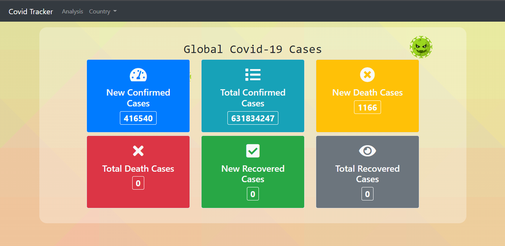

## About The Project

Covid Tracker: Implementation of a system that can read API /JSON data as part of the SOEN6441 - Advanced Programming Practices (APP) course at Concordia University.

Public API: https://api.covid19api.com/summary

Demo link: https://drive.google.com/file/d/1XlmWxgBkoSAM_yuzShtU2G3_dZ2HOmXz/view

<!-- CONTRIBUTING -->
## Contributing

Contributions are what make the open source community such an amazing place to learn, inspire, and create. Any contributions you make are **greatly appreciated**.

If you have a suggestion that would make this better, please fork the repo and create a pull request. You can also simply open an issue with the tag "enhancement".
Don't forget to give the project a star! Thanks again!

1. Fork the Project
2. Clone repository (`https://github.com/heyTanvi/SOEN6441-Project.git`)
3. Create your Feature Branch (`git checkout -b <remote>/SOEN6441-Project`)
4. Commit your Changes (`git commit -m 'Add some AmazingFeature'`)
5. Push to the Branch (`git push origin <remote>/AmazingFeature`)
6. Open a Pull Request

<!-- CONTACT -->
## Contact
* Email Id - Tanvi3209@gmail.com dinesh.skini@gmail.com

### Team Members:

--> Tannavi Gaurav

--> Dinesh Kini Bailoor
